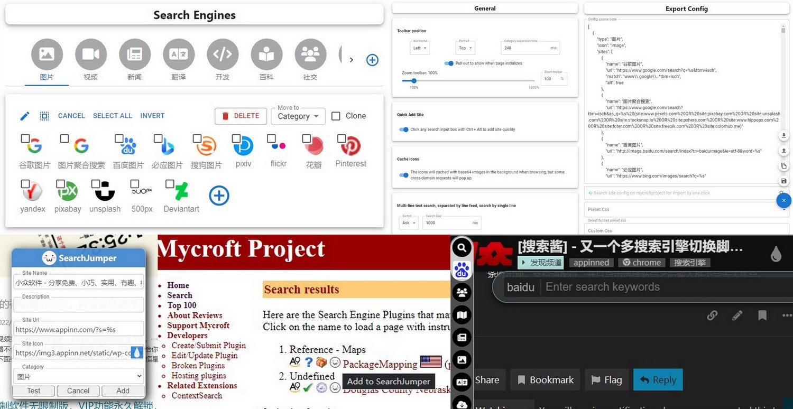
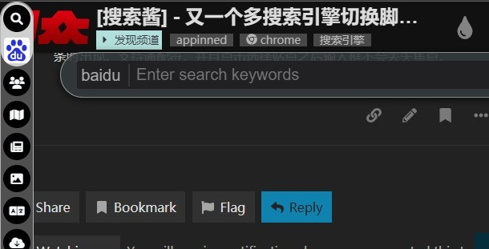
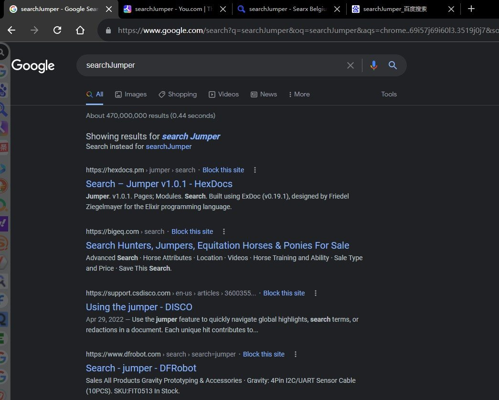

# [SearchJumper - 搜索醬](https://greasyfork.org/scripts/445274-searchjumper "搜索酱 検索ちゃん Install from greasyfork")  [👆Seek more sites 更多站點配置](https://github.com/hoothin/SearchJumper/issues?q=label%3A%22Sites+Rule%22)


> *A user script to assist in switching search engines*

[](https://greasyfork.org/scripts/445274-searchjumper)


+ Build with React.js
+ UI: [Material-UI](https://mui.com/)
+ Icons: [FontAwesome](https://fontawesome.com/)




## Features：
+ Search for pictures, links, videos, audios, pages, etc. (**long press the right mouse** on the corresponding object)
  > 可以搜索圖片、連結、視頻、音頻、頁面等（在相應對象上**長按右鍵**）
+ Support word search on any page (need to **long press the right mouse**, you can also change to swipe to call out immediately in the settings)
  > 支持任意頁面劃詞搜索（需要**長按右鍵**，亦可在設置中改為劃選立即調出）
+ Support search by site
  > 支持站內搜索
+ Shortcut keys (single key or key combination) to start search (such as alt+g Google search, which can be customized at will)
  > 可隨意使用快捷鍵（單個按鍵或者組合按鍵）開啟搜索（比如 alt+g 谷歌搜索，可隨意自定義）
+ Right-click the category icon to open the sites in batches
  > 滑鼠右鍵單擊類別圖標批量打開同一類別
+ Hold **`shift`** + left click on category icon to open batches in new window
  > 按住 **`shift`** 左鍵單擊類別圖標在新窗口批量打開
+ Hold **`ctrl`** + left click on category icon to open in background TAB
  > 按住 **`ctrl`** 左鍵單擊類別圖標以後臺標籤頁批量打開
+ Hold **`alt`** + left-click a category icon to batch open multiple separate windows
  > 按住 **`alt`** 左鍵單擊類別圖標以多個單獨窗口批量打開
+ Hold **`ctrl + shift`** + left click on category icon to open batches in incognito window
  > 按住 **`ctrl + shift`** 左鍵單擊類別圖標在隱身窗口批量打開
+ Hold **`alt + shift`** + left click on category icon to open batches embedding
  > 按住 **`alt + shift`** 左鍵單擊類別圖標批量嵌入打開
+ **`shift`** + left click on site icon to open in new window
  > 按住 **`shift`** 左鍵單擊站點以新窗口打開結果頁
+ **`ctrl`** + (left click/shortcut/drag) on site icon to open in background TAB
  > 按住 **`ctrl`** (左鍵單擊/快捷鍵/拖拽)站點以後臺標籤頁打開結果頁
+ **`alt`** + (left click/shortcut/drag) on site icon to preview in small window
  > 按住 **`alt`** (左鍵單擊/快捷鍵/拖拽)站點以小窗口預覽結果
+ **`ctrl + shift`** + (left click/shortcut/drag) single site/press shortcut key to open in incognito window.
  > 按住 **`ctrl + shift`** (左鍵單擊/快捷鍵/拖拽)站點以隱身窗口打開
+ Call search bar for input words to filter sites by shortcut key when select no words, press enter to search quickly, `ctrl` + enter to search without lock.
  > 沒有選擇文字或者圖片時通過喚出快捷鍵可喚出站點搜索框，搜索站點后按下回車可鎖定站點並輸入搜索詞，再次回車使用第一個結果搜索，ctrl+回車無需鎖定即可快捷打開，適用於靜態書簽。
+ Can set the category to be displayed only on the specified site through the regular rule
  > 可以通過正則設置類別僅在指定站點顯示
+ Right click on cute face to hide the toolbar
  > 右鍵點擊 小萌臉 徹底隱藏工具欄
+ Left click on cute face to open the configuration page
  > 左鍵點擊 小萌臉 打開配置頁
+ Support open with shortcut key, right click on the logo to close
  > 可隨意拖拽 小萌臉，並隨意選擇位置放置，例如上中，下中，左上，右上，上左，上右等
+ Support configuration export and quick sharing
  > 支持配置導出與快捷分享
+ Support middle button to open links in the background
  > 支持中鍵後台打開連結
+ Support custom css
  > 支持自定義樣式
+ Support full character encoding
  > 支持全字符編碼
+ Support Post, in-page post and non-jump post
  > 支持 Post、頁內 post 以及無跳轉 post
+ Comprehensive customization
  > 全面的自定義功能，詳見最下方【搜索參數】
+ No 3rd party dependencies
  > 無第三方依賴庫
+ Self-expand current category
  > 自展開當前類別並提前
+ No tamper with the original page
  > 不篡改原始頁面
+ Drag to search with current category
  > 拖拽搜索當前分類（文字/圖片/鏈接），内圈為當前分類前6個站點，外圈為最近使用的10個站點，可透過編輯第一個（文字/圖片/鏈接）分類來自定義内容

## Search params
| param | details | 詳述 |
| --- | --- | --- |
| `%s` | search keyword |🗒️ 搜索關鍵詞 |
| `%S` | cached search keyword |🗒️ 最近一次的搜索關鍵詞 |
| `%sl` | search keyword with lower case letters |🗒️ 小寫字母搜索詞 |
| `%su` | search keyword with upper case letters |🗒️ 大寫字母搜索詞 |
| `%sr` | search keyword without doing any encoding |🗒️ 未轉碼的搜索關鍵詞 |
| `%e` | charset | 🗒️ 編碼 |
| `%c` | client pc,mobile | 🗒️ 客戶端 pc,mobile |
| `%u` | current website url | 🗒️ 當前網站 url |
| `%U` | url with encodeURIComponent | 🗒️ 當前網站 url 的 URI 編碼 |
| `%h` | current website host | 🗒️ 當前網站 host |
| `%t` | target src | 🗒️ 指向對象的 src |
| `%T` | %t with encodeURIComponent | 🗒️ 指向對象的 src 的 URI 編碼 |
| `%b` | target src without http | 🗒️ 指向對象 src 去頭 |
| `%B` | %b with encodeURIComponent | 🗒️ 指向對象 src 去頭 的 URI 編碼 |
| `%i` | base64 of target image | 🗒️ 指向圖片的 base64 |
| `%s.replace` | replace keywords with regexp, like %sr.replace(/[^\d]/g, "").replace(/(\d)/g, "$1 ") means replace raw keywords to numbers and then join all numbers with space, support %s %sl %sr %su %t %u |🗒️ 用正則替換搜索關鍵詞，例如 %sr.replace(/[^\d]/g, "").replace(/(\d)/g, "$1 ") 代表提取原始關鍵詞中所有數字，並以空格分隔，支持  %s %sl %sr %su %t %u |
| `%p{params}` | post body, like %p{x=1&y=%s} | 🗒️ post 參數體，例如 %p{x=1&y=%s} |
| `%P{params}` | post without navigation | 🗒️ post 但不跳轉 |
| `%input{tips}` | input something, like %input{love who?,you} | 🗒️ 輸入占位，例如%input{請輸入您的三圍,90 55 90} |
| `#p{params}` | post in page, like #p{#input=%u&div.param=2&sleep=500&c=click()}, use \\& \\= instead of & = in content | 🗒️ 頁内 post，可在頁面之内使用【css選擇器】填寫參數提交查詢，適用於不開放GET/POST接口的網站，例如 #p{#input=%u&div.param=2&sleep=500&c=click()}, 可在内容中使用 \\& \\= 來 表示 & = |
| `["siteName1","siteName2"]` | batch open by site name you've created | 🗒️ 透過你已經創建的站點名批量打開，例如 \["雅虎搜索","谷歌搜索"\] |
| `%element{}` | query element for innerText from selector or xpath, like %element{.mainTitle} | 🗒️ 透過 css 選擇器或 xpath 抓取元素並返回文字内容，例如 %element{.mainTitle} |
| `%element{}.prop()` | return prop value for queried element, like %element{.mainTitle}.prop(href) %element{.mainTitle}.prop(innerHTML) | 🗒️ 獲取抓取到元素的屬性值，例如 %element{.mainTitle}.prop(href) %element{.mainTitle}.prop(innerHTML) |
| `%element{}.replace()` | replace, same as above, like %element{.mainTitle}.prop(href).replace(/https/i,"") | 🗒️ 正則替換，例如 %element{.mainTitle}.prop(href).replace(/https/i,"") |
| `c:` | put this at first then all words after will be copied to the clipboard | 🗒️ 在開頭使用"c:"可以複製之後的所有字串 |

 <details>
<summary><h2>Add search engines quickly 快速添加搜索引擎</h></summary>

+ Add with shortcut key on current page 通過快捷鍵快速在當前頁面添加
> click search input box with `ctrl + shift` 按住 `ctrl + shift` 點擊當前頁面中的搜索輸入框即可

+ Search on mycroftproject.com and add  在 mycroftproject 上搜索別人編輯好的站點並點擊導入
> Click the searchJumper face icon in sites list on mycroftproject 點擊 mycroftproject 上站點列表裏的搜索醬圖標即可

 </details>

---
 <details>
<summary><h2>Filter sites to search 站點篩選並搜索</h></summary>

+ Call by global shortcut key, Input keywords of site name to filter sites, support glob with "?/\*" 通過全局快捷鍵喚出，輸入站點名稱的關鍵詞來篩選，支持 “?/\*” 通配符
+ Enter to lock filter and input words to search by click icon or another press of enter 回車鎖定篩選，輸入文字并且點擊站點圖標或者再次回車來進行搜索


 </details>

---
 <details>
<summary><h2>Call by event 透過鼠標手勢調用</h></summary>

+ Search by site name 以站點名調用搜索
``` javascript
// search by google
const siteName = 'Google search';
const searchJumperEvent = new CustomEvent('searchJumper', {
  detail: {
    action: 'search',
    name: siteName
  }
});
document.dispatchEvent(searchJumperEvent);
```
+ Show search bar 顯示搜索條
``` javascript
const searchJumperEvent = new CustomEvent('searchJumper', {
  detail: {
    action: 'show'
  }
});
document.dispatchEvent(searchJumperEvent);
```
+ Search by second shown site button and open in new window 使用當前展開的第二個站點搜索並在小窗打開結果
``` javascript
const siteOrder = 2;
let currentSite = document.querySelector(`.search-jumper-type:not(.search-jumper-hide)>a:nth-of-type(${siteOrder})`);
if (currentSite) {
  const searchJumperEvent = new CustomEvent('searchJumper', {
    detail: {
      action: 'search',
      name: currentSite.dataset.name,
      key: {altKey:true}
    }
  });
  document.dispatchEvent(searchJumperEvent);
}
```
+ Search by site of current type in background tab 使用當前選中類別的站點搜索並在後臺標籤頁打開結果
``` javascript
const searchJumperEvent = new CustomEvent('searchJumper', {
  detail: {
    action: 'search',
    key: {ctrlKey:true}
  }
});
document.dispatchEvent(searchJumperEvent);
```
+ Search by second site of current type in incognito tab 使用當前選中類別的第二個站點搜索並在隱身標籤頁打開結果
``` javascript
const siteOrder = 2;
const searchJumperEvent = new CustomEvent('searchJumper', {
  detail: {
    action: 'search',
    index: siteOrder,
    key: {ctrlKey:true, altKey:true}
  }
});
document.dispatchEvent(searchJumperEvent);
```
 </details>

---
 <details>
<summary><h2>Download all video with lux 使用 LUX 下載全網視頻</h></summary>
Registry patch to call lux by SearchJumper 搜索醬調用本地程式的注冊表補丁

``` ini
Windows Registry Editor Version 5.00

[HKEY_CLASSES_ROOT\lux]
@="URL:lux Protocol"
"URL Protocol"=""

[HKEY_CLASSES_ROOT\lux\DefaultIcon]
@="cmd.exe,1"

[HKEY_CLASSES_ROOT\lux\shell]

[HKEY_CLASSES_ROOT\lux\shell\open]

[HKEY_CLASSES_ROOT\lux\shell\open\command]
@="cmd /c set m=%1 & call set m=%%m:lux://=%% & d: & cd \"D:\\Program Files\\lux\" & call lux.exe %%m%% & pause"
```
Modify path by yourself 自行修改補丁中的目錄，保存爲 lux.reg，雙擊導入注冊表。

Open the page of video and download with `lux://%u` 完畢之後即可新建站點使用 `lux://%u` 調用 lux 下載當前網頁視頻
 </details>

---
 <details>
<summary><h2>Batch open types 多種批量打開方式</h></summary>
  
+ **`shift`** + click category icon

  
+ **`alt + shift`** + click category icon

  
+ **`alt`** + click category icon


 </details>
